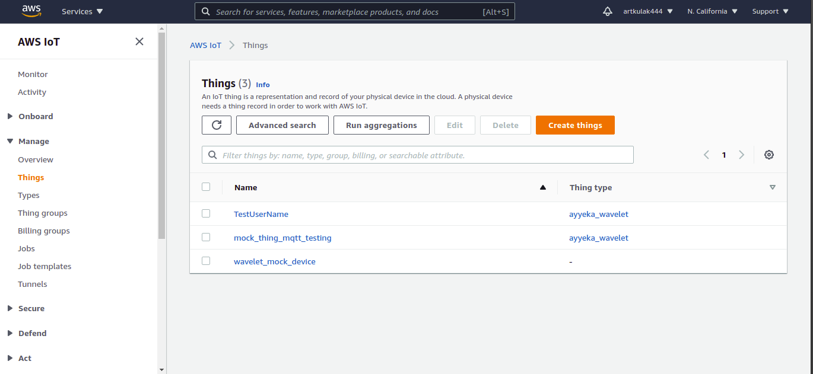

# Wavelet & AWS IoT Core Integration

<p align="center">
  <a href="https://www.ayyeka.com/">
  
  </a>
</p>

## Guide Overview

This guide will walk you through integrating a Wavelet device to AWS IoT Core. At the end of this guide, your Wavelet will transmit its sensor data to AWS IoT Core and receive remote configuration commands from Ayyeka's FAI-Pro platform, as shown in the following figure:


The guide is structured as follows:
* AWS IoT Core Intro
* AWS IoT Core Configuration
* Device Side Configuration

## AWS IoT Core Intro

**AWS IoT Core** provides building blocks for cloud-based IoT solutions. The key services of **AWS IoT Core** are:
* Device ("thing") registry 
* Device provisioning, authentication and authorization 
* Data ingestion over HTTPS or MQTTS
* Rule-based data routing

Other services  of **AWS IoT Core** are:
* Integration with popular AWS data processing tools (Lambda, S3, SNS, SQS etc.)
* Device shadows
* Jobs

### AWS IoT Core – Things registry

IoT devices are called “things” in AWS IoT. Each thing has a "type", which defines certain properties. Possible type examples are:
* Datalogger4G has required fields: `display_name`, `serial_number` and `UUID`
* Datalogger3G has only one required field: `serial_number`

Types and things are created and managed by admin users. When creating a thing, it is registered in the `Things registry`.
The `Things registry` can be accessed by other AWS Services (e.g. Lambda functions) 

> **Note**: It is not mandatory to register your thing in the Things registry. Data can be ingested from unregistered things as well.


### AWS IoT Core – Device Authentication
AWS IoT Core supports multiple authentication options: <br>

**Protocols, authentication, and port mappings**  

| Protocol | Operations supported | Authentication | Port | ALPN protocol name | 
| --- | --- | --- | --- | --- | 
|  MQTT over WebSocket  | Publish, Subscribe | Signature Version 4 | 443 |  N/A  | 
|  MQTT over WebSocket  | Publish, Subscribe | Custom authentication | 443 |  N/A  | 
|  MQTT  | Publish, Subscribe |  X\.509 client certificate  |  443†  |  'x-amzn-mqtt-ca'  | 
| MQTT | Publish, Subscribe | X\.509 client certificate | 8883 | N/A | 
| **MQTT**  | **Publish, Subscribe** |  **Custom authentication**  |  **443**†  |  **'mqtt'**  | 
|  HTTPS  | Publish only |  Signature Version 4  |  443  |  N/A  | 
|  HTTPS  | Publish only |  X\.509 client certificate  |  443†  |  'x-amzn-http-ca'  | 
| HTTPS | Publish only | X\.509 client certificate | 8443 | N/A | 
| HTTPS | Publish only | Custom authentication | 443 | N/A | 

Wavelet supports the “Custom authentication” option over MQTT. See `Custom authentication` option above. <br>
<br>
**Custom Authentication** requires an **Authorizer Lambda Function**:
* The **Authorizer Lambda** receives the device’s MQTT credentials and verifies them
* Verification can be done against AWS IoT Things registry OR any other data source

### AWS IoT Core – Data Routing

Devices can publish their data over MQTT to AWS IoT Core
> **Note**: the device must be granted **permission to publish** to a certain topic. See Authorizer Lambda below.

Each received MQTT message is tested against a user-defined set of rules. A `rule` is defined by three elements:
* `Filter`: defines which MQTT topics and messages will be processed by this rule
* `Action`: defines the action that is triggered by this rule
* `Data extraction`: defines which data should be passed on if the rule is matched. <br>

With `rules` and `actions`, common IoT tasks can be handled:
* Decoding raw data from the devices, e.g. `convert Protobuf to JSON`
* Republishing data to other systems
* Storing the data in a database

### Wavelet & MQTT – The Fine Print

**MQTT User & Password:**
* Must be configured to a valid username and password, per the AWS IoT Core setup
* Note: empty `username` or empty `password` will force Wavelet to use its hardcoded defaults, which do not match the credentials defined by the Authorizer Lambda by default.

**MQTT ClientID:**
* Wavelet is sending its AKID as the MQTT Client ID. 
* The AKID can be retrieved on FAI-Pro user interface or through the REST API

**MQTT Topics:**

| Protocol | Operations supported | Authentication | 
| --- | --- | --- |
| /wv/`<AKID>`/1/`samp`/p1 | Sensor data and device telemetry | Protobuf, see **SampleMessage.proto** for defenition |
| wv/`<AKID>`/1/`reportend`/p1 | Last will and session termination reason | Protobuf, see **ReportEnd.proto** for defenition |


## AWS IoT Core Configuration
This is what we want to achieve : 
Allow devices to authenticate and publish messages in a secure manner. 
As the diagram shows, devices communicate with AWS IoT Core, which utilises AWS Lambda to handle the logic behind authentication and message decoding.


### Configuration Process Overview

**Step 1**: Configure simple authentication process
* [Create a Custom Authorizer Lambda function](#11-Create-a-Custom-Authorizer-Lambda-function)
* [Create an Authorizer on AWS IoT Core](#12-Create-an-Authorizer-on-AWS-IoT-Core)
* [Test authentication process](#13-Test-authentication-process)

**Step 2**: Configure a data processing rule
* [Creating a Data Processing Lambda](#21-Creating-a-Data-Processing-Lambda)
* [Create a `rule` and an `action`](#22-Create-a-Rule-and-an-Action)
* [Test Data Processing rule](#23-Test-Data-Processing-rule)

**Step 3**: (Optional) Configure custom device authentication process with `Things registry`
* [Create a Custom Authorizer Lambda function](#31-Create-a-Custom-Authorizer-Lambda-function)
* [Create an Authorizer on AWS IoT Core](#32-Create-an-Authorizer-on-AWS-IoT-Core)
* [Register a device in the Things registry (Optional)](#33-Register-a-device-in-the-Things-registry-Optional)
* [Give the auth Lambda access to `Things registry` (Optional)](#34-Give-the-auth-Lambda-access-to-Things-registry-Optional) 
* [Test Custom Authorizer (Optional)](#35-Test-Custom-Authorizer-Optional)

# Intro and explaination

The three steps available handle authentication and data processing, we have two modes of authentication (step 1, step 3)

# **Step 1** 
### Configure simple authentication process

* aws_iot_authorizer_simple just checks the username and password sent by the device over MQTT against a constant USERNAME and PASSWORD, so basically there is only one master (username, password) pair and all devices should provide it and have it hard coded in their running code/script.

### 1.1 Create a Custom Authorizer Lambda function

1. Download the project from GitHub: [aws_iot_core_integration](http://github.com/ayyeka/aws_iot_core_integration)


2. Locate the file  `Lambda_function.py` under the `aws_iot_authorizer_simple`

3. This Lambda will authorize devices with MQTT username and password that match certain constants in the Python code `aws_iot_authorizer_simple`
You can edit these constants in `lambda_function.py` code to match your setup:
    ```
    USERNAME = "TestUserName"
    PASSWORD = "TestPassword"
    ```


4. Upload the edited file to AWS Lambda and create a Lambda function called `simple-custom-iot-auth` in the same region of your AWS IoT Core.


> **Note**: `USERNAME` and `PASSWORD` fields are hardcoded and are later used for the device validation step.

### 1.2 Create an Authorizer on AWS IoT Core

1. On AWS IoT Core, navigate to the ‘Secure’ menu and then choose ‘Authorizers’
2. Click the "Create" button and in the next screen configure the following:
* **Name**: `mySimpleAuth`
* **Authorizer Function**: pick the name of the Lambda you created `simple-custom-iot-auth`
* **Enable Token Signing**: `unticked`
* **Activate Authorizer**: `ticked`
3. Click the `Create Authorizer`

### 1.3 Test authentication process
Testing the authentication process is the same for both `Step 1` and `Step 3`, check the [Test Custom Authorizer (Optional)](#35-Test-Custom-Authorizer-Optional) section

# **Step 2**
### Configure a data processing rule
### 2.1 Creating a Data Processing Lambda

1. Download the project from GitHub: http://github.com/ayyeka/aws_iot_core_integration

2. Under the `aws_iot_data_processing_lambda` you’ll find `lambda_function.py`. This Lambda is has external package dependencies, hence it needs to be zipped together with its dependencies.

3. From the command line, navigate to the `aws_iot_data_processing_lambda` directory and execute the following command to collect all Python packages require by this Lambda:

```
pip install -r requirements.txt -t .
```

4. Zip all the content of the `aws_iot_data_processing_lambda` directory and upload it to AWS Lambda to create a new Lambda called `aws_iot_data_processing_lambda`

This Lambda will receive the Protobuf payloads from the device, decode it, and create a user-friendly JSON response. 
> See the "Authentication and Metadata from the Things registry" section for details on how to enhance this Lambda with more metadata.

### 2.2 Create a Rule and an Action

1. On AWS IoT Core, navigate to the ‘Act’ menu and then choose ‘Rules’
2. Click the ‘Create’ button and then configure the following:
* **Name**: `myrule`
* **SQL Version**: `no change`
* **Rule Query Statement**:
```
SELECT 	clientid() as client_id, topic() as topic, encode(*, 'base64') as data, timestamp() as timestamp FROM 'wv/#'
```

* **Action**: Send to Lambda -> Configure Action -> Select `aws_iot_data_processing_lambda` -> Add

3. This rule will match all the data published by the devices by subscribing to the topic “wv/#”
4. The devices’ protobuf binary payloads will be forwarded to the data processing Lambda function as Base64 strings.

## 2.3 Test Data Processing rule
> **Note**: We'll be using pub.py for testing authorisation and data processing, please take a look at the `CONFIG` section inside the code and change the constants depending on your AWS info, device username and password...

Using the defined protobuf message structures, we can test with an MQTT client using [awsiotsdk](https://AWS.github.io/AWS-iot-device-sdk-python-v2/).
Take a look at [protobuf docs for python](https://developers.google.com/protocol-buffers/docs/pythontutorial) and the starter [pub.py](#) script.

The script connects and authenticate to AWS IoT by using the simple_authorizer. It then publishes multiple protobuf `SamplesBatchMessage` to the `/wv/<AKID>/1/samp/p1` topic.
Message structures are defined under `proto` folder.

You can visualize published protobuf messages in you AWS IoT console, under `Act > Test` 
Enter the devices' topic with it's `/wv/<AKID>/1/samp/p1`, and then click subscribe.

You should see the received messages. They will not be readable because they are in protobuf-encoded format.

On the data processing Lambda side, you can consult the Lambda logs and see messages routed by the AWS IoT `rule` on `'wv/#'` topics.

Under `Lambda > Functions > aws_iot_data_processing_lambda`, 
Click `Monitor`, and then `Logs`.
> **Note**: There is a ~3 mins delay between running your script and getting AWS Lambda logs.

Under logs you should see the decoded protobuf messages.

# **Step 3**
### (Optional) Configure custom device authentication process with Things registry

* aws_iot_authorizer_things_registry, on the other hand, gets a username, password pair and checks them on your AWS IoT thing registry to make sure you’ve registered this device as a “thing”, and compares username to UUID and password to SECRET_KEY.
Note that UUID and SECRET_KEY are “thing” attributes that you define when creating the thing.
So here each device has its own credentials that will be checked against the thing registry.

### 3.1 Create a Custom Authorizer Lambda function


1. Download the project from GitHub: [aws_iot_core_integration](http://github.com/ayyeka/aws_iot_core_integration)


2. Locate the file  `lambda_function.py` under `aws_iot_authorizer_things_registry`

3. This Lambda will authorize devices with MQTT username and password that match certain attributes unique for each `Thing` registered in AWS IoT.


4. Upload the edited file to AWS Lambda and create a Lambda function called `aws_iot_authorizer_things_registry` in the same region of your AWS IoT Core.

### 3.2 Create an Authorizer on AWS IoT Core

1. On AWS IoT Core, navigate to the ‘Secure’ menu and then choose ‘Authorizers’
2. Click the "Create" button and in the next screen configure the following:
* **Name**: `myThingAuth`
* **Authorizer Function**: pick the name of the Lambda you created `aws_iot_authorizer_things_registry`
* **Enable Token Signing**: `unticked`
* **Activate Authorizer**: `ticked`
3. Click the `Create Authorizer`

### 3.3 Register a device in the Things registry (Optional)

We'll need to register things inside AWS IoT Core, open `Manage > Things`

1. Click `Create`, and then `Create a single thing`
Give it a name, and then add attributes under the `Set searchable thing attributes` section.

    | Attribute key | Value | 
    | --- | --- |
    | SECRET_KEY | device auth password |
    | UUID | device auth username |

2. Click `Create thing without certificate`
You should see the thing added under `Things`

### 3.4 Give the auth Lambda access to `Things registry` (Optional)

See referenced section bellow
> **Note**: See the “Authentication and Metadata from the Things registry” section for details on how to allow this Lambda to retrieve authentication information from the Things registry. **MAKE SURE that any Lambda that needs to access the `Things registry` granted the ListThings policy, see the** “Authentication and Metadata from the Things registry” **section for details**

### 3.5 Test Custom Authorizer (Optional)
> **Note**: We'll be using [pub.py](#) for testing authorisation and data processing. Look at the `CONFIG` section inside the code and change the constants depending on your AWS info, device username and password...

The [pub.py](#) script takes care of connecting to the authorizer over MQTT and publishing protobuf messages. In this section we're only testing the auth Lambdas and the custom authorizer we created in AWS IoT are working.

After running the script, open your Lambda in AWS Lambda console. 
For example, open `Lambda > Functions > aws_iot_authorizer_things_registry`.
Then open `Monitor > Logs`
You should see the routed auth requests sent by the custom authorizer to this Lambda.
> **Note**: There is a ~3 mins delay between running your script and AWS Lambda logs.


## Device Side Configuration
1. On the FAI-Pro platform, navigate to the ‘Advanced Device Configuration’ -> ‘GSM’ module configuration
2. For `username` and `password` fields refer to **Creating an Authorizer Lambda** section above.
3. Configure the following items: 


| Item Name | Value | Comments | 
| --- | --- | --- |
| MQTT Server Address | `<AWS IoT Endpoint URL>` Example: azyffu1i8-ats.iot.eu-west-1.amazonaws.com | To get the  `<AWS IoT Endpoint URL>` go to **AWS IoT Core** -> **Setting**. You will find your url under **Device data endpoint** tab. Max length: 100 characters |
| MQTT Server Port | 443 | |
| mqtt_handler | AWS_IOT_PROTOBUF |This setting triggers the TLS SNI and ALPN extensions, and disables the MQTT retain flag |
| mqtt_client_id | | Leave empty |
| User_defined_mqtt_user | `<username>`?x-amz-customauthorizer-name=**myauth** | Note: `<username>` will be passed to the authorizer Lambda that is connected to the **myauth** IoT Core Authorizer <br> **Firmware v2.394** Max length: 45 characters <br> **Firmware v2.395 and above** Max length: 100 characters |
| User_defined_mqtt_pass | `<password>` | **Note 1**: `<password>` will be passed to the authorizer Lambda that is connected to the **myauth** IoT Core Authorizer <br> **Note 2**: do not leave empty, otherwise the user_defined_mqtt_user field will be ignored. <br> Max length: 25 characters |


> **Important note**: Make sure the `username` and `password` configured here will be accepted by the Authorizer Lambda you configured in the previous step.
  
  
## Testing the work of Authorizer Lambda
  
1. Download and install mosquitto. Various installation tutorials are available [here](https://mosquitto.org/download/). Here is a [good Ubuntu installation tutorial](https://www.vultr.com/docs/how-to-install-mosquitto-mqtt-broker-server-on-ubuntu-16-04)
2. Download the AmazonRootCA1.pem file from [here](https://www.amazontrust.com/repository/AmazonRootCA1.pem) . We will need it later
3. To get the endpoint link go to **AWS IoT Core** -> **Settings**. You will find your endpoint url under **Device data endpoint** tab
4. Don't forget to include your AWS `<username>` , `<password>` , `<AWSLambdaAuth>`. Pay attention to `-t` and `--will-topic` params. The topics should have the following format to be accepted by the authorizer `wv/*`. Note that on the previous steps we set `<AWSLambdaAuth>=myauth` when setting up authorizers on IoT Core. `<myClientName>` can be any for now, as it is not validated in `aws_iot_authorizer_simple`, though you may want to include it, if you are using your custom authorizer.
5. Run the following command <br>
```mosquitto_pub -h "[MY_ENDPOINT]-ats.iot.ap-southeast-2.amazonaws.com" -p 443 -t "wv/sample" -m "Hello World" -i "<myClientName>" -u "<username>?x-amz-customauthorizer-name=<AWSLambdaAuth>" -P "<password>" --tls-alpn mqtt --cafile AmazonRootCA1.pem --will-payload "Goodbye" --will-topic "wv/lastwill" --will-qos 1 --repeat 10 --repeat-delay 1 --debug```
6. If you have done everything correctly, your client should get authorized and you will start recieving `PUBLISH` messages. 
7. Now you can go to the page with your `simple-custom-iot-auth` -> `Monitor` -> `Logs` and see that the recent invocation appeared!
  
 


  
## Authentication and Metadata from the Things registry (OPTIONAL)
  
In case we use `aws_iot_authorizer_simple`, our Lambda functions were basic:
* The MQTT username & password were verified against constants in the Lambda’s code
* The data processing Lambda merely translated the Protobuf to JSON

This is useful for integration PoC, but less so for production deployments. 
New objective:
* Verify the MQTT credentials devices against the Things registry
* Add additional metadata to the response JSON of the data processing Lambda

The process:
* Create a thing `Type`, this will allow us to created multiple `Things` from the same type (same attributes)

* Create a `Thing` and populate its metadata fields (e.g. UUID, SECRET_KEY etc) under attributes section

* Create a new Authorizer in AWS IoT and add the `aws_iot_authorizer_things_registry` Lambda to it while creating

* Grant the two Lambdas that use the `thing registy` access, `aws_iot_authorizer_things_registry` and `aws_iot_data_processing_lambda`, go to your [IAM dashboard](https://console.AWS.amazon.com/iam/home#/roles), here you'll find a predefined `role` given to each Lambda, we need to make sure our Lambdas can are allowed to access the `IoT registery` : 
    * Click on the correponding role (example : aws_iot_authorizer_things_registry-role-4zaa3q3w, this can have different ending id in your case)
    
    * Click on `+ Add inline policy`
    * Enter "iot" in the `Service` field and select `IoT`
    * Expand the `List` dropdown under `Access level`
    * Choose `ListThings` then click the `Review policy` button
    * Give the policy name then click `Create Policy`

